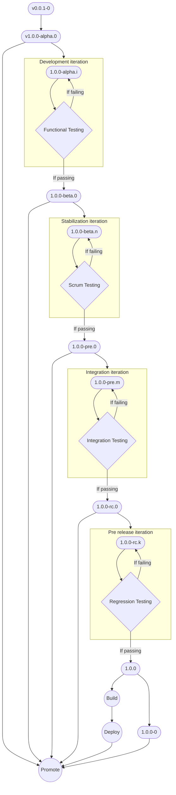

# Build Promotion and tagging strategy

```mermaid
flowchart
    subgraph developmentIterations[Development iteration]
        develop([1.0.0-alpha.i])
        initTesting{Functional Testing}
    end
    subgraph stabilizationIterations[Stabilization iteration]
        stabilize([1.0.0-beta.n])
        scrumTesting{Scrum Testing}
    end
    subgraph integrationIterations[Integration iteration]
        integration([1.0.0-pre.m])
        integrationTesting{Integration Testing}
    end
    subgraph preReleaseIterations[Pre release iteration]
        finalization([1.0.0-rc.k])
        regressionTesting{Regression Testing}
    end
    preInit([v0.0.1-0])
    preDevelop([v1.0.0-alpha.0])
    preStabilize([1.0.0-beta.0])
    preIntegration([1.0.0-pre.0])
    preFinalization([1.0.0-rc.0])
    release([1.0.0])
    postRelease([1.0.0-0])
    promote((Promote))
    build((Build))
    deploy((Deploy))

    preInit-->preDevelop
    preDevelop-->promote
    preDevelop-->developmentIterations
    develop-->initTesting
    initTesting-->|If passing|preStabilize-->promote
    initTesting-->|If failing|develop
    preStabilize-->stabilizationIterations
    stabilize-->scrumTesting
    scrumTesting-->|If passing|preIntegration-->promote
    scrumTesting-->|If failing|stabilize
    preIntegration-->integrationIterations
    integration-->integrationTesting
    integrationTesting-->|If passing|preFinalization-->promote
    integrationTesting-->|If failing|integration
    preFinalization-->preReleaseIterations
    finalization-->regressionTesting
    regressionTesting-->|If passing|release
    release-->build
    build-->deploy
    deploy-->promote
    regressionTesting-->|If failing|finalization
    release-->postRelease-->promote
```