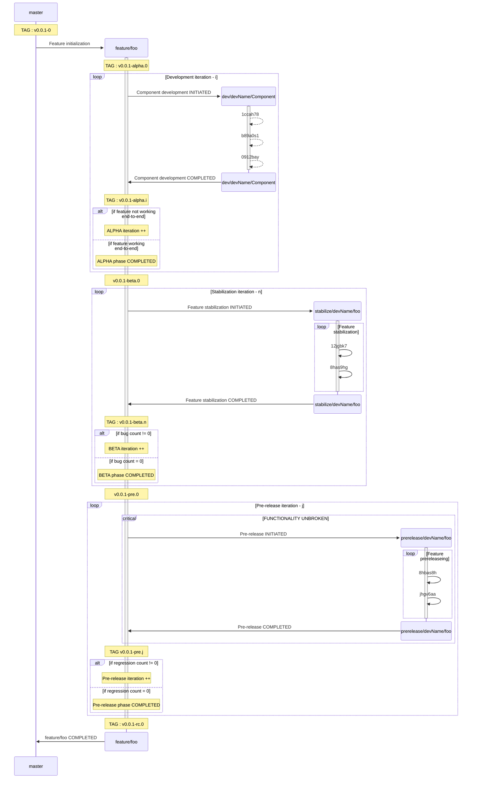

# Development branching sequence

```mermaid
sequenceDiagram
    participant master
    Note over master: TAG : v0.0.1-0
    create participant feature/foo
    master->>feature/foo: Feature initialization
    activate feature/foo
    Note over feature/foo: TAG : v0.0.1-alpha.0
    loop Development iteration - i
        create participant dev/devName/Component
        feature/foo->>dev/devName/Component: Component development INITIATED
        activate dev/devName/Component
        dev/devName/Component-->>dev/devName/Component: 1ccah78
        dev/devName/Component-->>dev/devName/Component: b89a0s1
        dev/devName/Component-->>dev/devName/Component: 0912bay
        deactivate dev/devName/Component
        destroy dev/devName/Component
        dev/devName/Component->>feature/foo: Component development COMPLETED
        Note over feature/foo: TAG : v0.0.1-alpha.i
        alt if feature not working end-to-end
            Note over feature/foo: ALPHA iteration ++
        else if feature working end-to-end
            Note over feature/foo: ALPHA phase COMPLETED
        end
    end
    Note over feature/foo: v0.0.1-beta.0
    loop Stabilization iteration - n
        create participant stabilize/devName/foo
        feature/foo->>stabilize/devName/foo: Feature stabilization INITIATED
        activate stabilize/devName/foo
        loop Feature stabilization
            stabilize/devName/foo->>stabilize/devName/foo: 12jgbk7
            stabilize/devName/foo->>stabilize/devName/foo: 8has9hg
        end
        deactivate stabilize/devName/foo
        destroy stabilize/devName/foo
        stabilize/devName/foo->>feature/foo:  Feature stabilization COMPLETED
        Note over feature/foo: TAG : v0.0.1-beta.n
        alt if bug count != 0
            Note over feature/foo: BETA iteration ++
        else if bug count = 0
            Note over feature/foo: BETA phase COMPLETED
        end
    end
    Note over feature/foo: v0.0.1-pre.0
    loop Pre-release iteration - j
        critical FUNCTIONALITY UNBROKEN
            create participant prerelease/devName/foo
            feature/foo->>prerelease/devName/foo: Pre-release INITIATED
            activate prerelease/devName/foo
            loop Feature prereleaseing
                prerelease/devName/foo->>prerelease/devName/foo: 8hbas8h
                prerelease/devName/foo->>prerelease/devName/foo: jhgv6aa
            end
            deactivate prerelease/devName/foo
            destroy prerelease/devName/foo
            prerelease/devName/foo->>feature/foo: Pre-release COMPLETED
        end
        Note over feature/foo: TAG v0.0.1-pre.j
        alt if regression count != 0
            Note over feature/foo: Pre-release iteration ++
        else if regression count = 0
            Note over feature/foo: Pre-release phase COMPLETED
        end
    end
    Note over feature/foo: TAG : v0.0.1-rc.0
    deactivate feature/foo
    destroy feature/foo
    feature/foo->>master: feature/foo COMPLETED
```