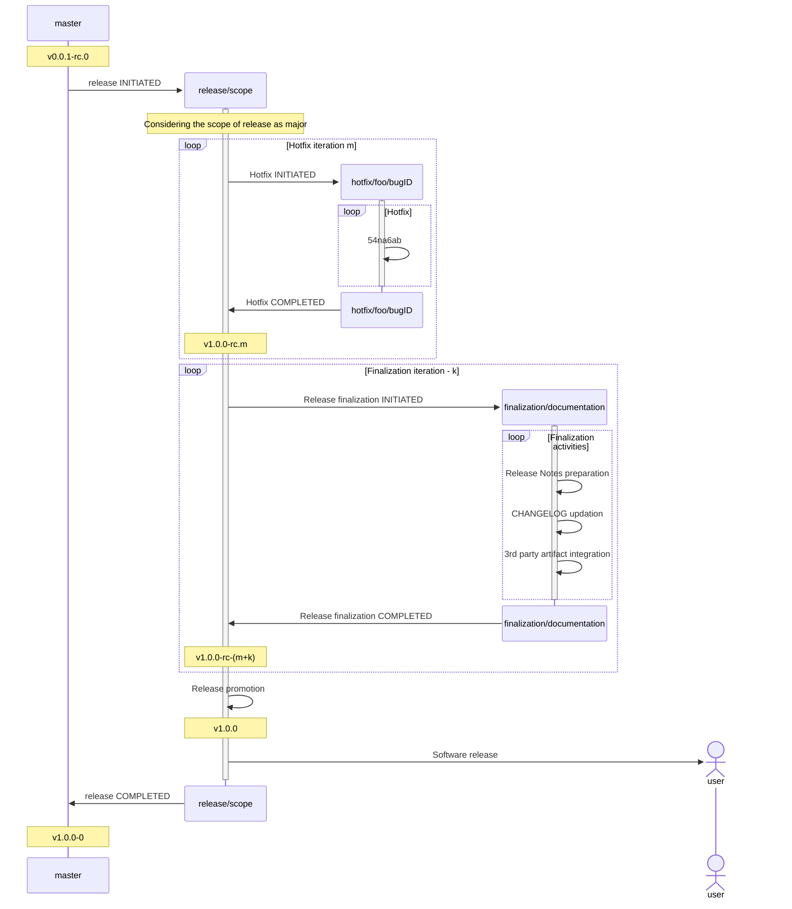

# Release branching sequence

```mermaid
sequenceDiagram
    participant master
    Note over master: v0.0.1-rc.0
    create participant release/scope
    master->>release/scope: release INITIATED
    activate release/scope
    Note over release/scope: Considering the scope of release as major
    loop Hotfix iteration m
        create participant hotfix/foo/bugID
        release/scope->>hotfix/foo/bugID: Hotfix INITIATED
        activate hotfix/foo/bugID
        loop Hotfix
            hotfix/foo/bugID->>hotfix/foo/bugID: 54na6ab
        end
        deactivate hotfix/foo/bugID
        destroy hotfix/foo/bugID
        hotfix/foo/bugID->>release/scope: Hotfix COMPLETED
        Note over release/scope: v1.0.0-rc.m
    end
    loop Finalization iteration - k
        create participant finalization/documentation
        release/scope->>finalization/documentation: Release finalization INITIATED
        activate finalization/documentation
        loop Finalization activities
            finalization/documentation->>finalization/documentation: Release Notes preparation
            finalization/documentation->>finalization/documentation: CHANGELOG updation
            finalization/documentation->>finalization/documentation: 3rd party artifact integration
        end
        deactivate finalization/documentation
        destroy finalization/documentation
        finalization/documentation->>release/scope: Release finalization COMPLETED
        Note over release/scope: v1.0.0-rc-(m+k)
    end
    release/scope->>release/scope: Release promotion
    Note over release/scope: v1.0.0
    create actor user
    release/scope->>user: Software release
    destroy actor user
    deactivate release/scope
    destroy release/scope
    release/scope->>master: release COMPLETED
    Note over master: v1.0.0-0
```