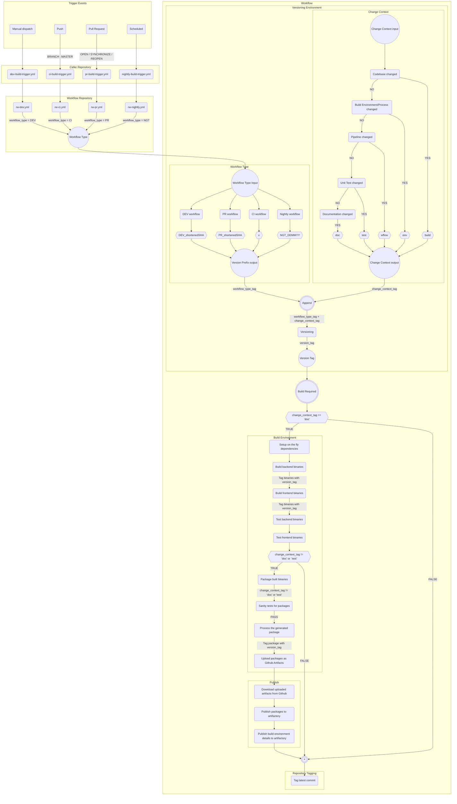

# Workflow Design

```mermaid
flowchart TB
    subgraph events[Trigger Events]
        manualDispatchEvent(Manual dispatch)
        pushEvent(Push)
        pullRequestEvent(Pull Request)
        scheduledEvent(Scheduled)
    end

    subgraph callerRepo[Caller Repository]
        devBuildTrigger(dev-build-trigger.yml)
        prBuildTrigger(pr-build-trigger.yml)
        ciBuildTrigger(ci-build-trigger.yml)
        nightlyBuildTrigger(nightly-build-trigger.yml)
    end

    subgraph workflowRepo[Workflow Repository]
        direction TB
        typeInput((Workflow Type))
        devWorkflow(rw-dev.yml)
        prWorkflow(rw-pr.yml)
        ciWorkflow(rw-ci.yml)
        nightlyWorkflow(rw-nightly.yml)

        devWorkflow -->|workflow_type = DEV| typeInput
        prWorkflow -->|workflow_type = PR| typeInput
        ciWorkflow -->|workflow_type = CI| typeInput
        nightlyWorkflow -->|workflow_type = NGT| typeInput
    end

    subgraph workflow[Workflow]
        direction TB
        buildRequired(((Build Required)))
        taggingStepCondition(((+)))
        docChangeContextTag{{change_context_tag == 'doc'}}
        
        subgraph versioning[Versioning Environment]
            processAppend(((Append)))
            stepVersioning(Versioning)
            versionTagOutput((Version Tag))

            subgraph workflowType[Workflow Type]
                direction TB
                workflowTypeInput((Workflow Type Input))
                workflowTypeOutput((Version Prefix output))
                workflowTypePR(PR workflow)
                workflowTypeDEV(DEV workflow)
                workflowTypeCI(CI workflow)
                workflowTypeNightly(Nightly workflow)

                prefixDEV{{"DEV_shortenedSHA"}}
                prefixPR{{"PR_shortenedSHA"}}
                prefixCI{{"v"}}
                prefixNightly{{"NGT_DDMMYY"}}

                workflowTypeInput --> workflowTypeDEV
                workflowTypeInput --> workflowTypePR
                workflowTypeInput --> workflowTypeCI
                workflowTypeInput --> workflowTypeNightly

                workflowTypeDEV --> prefixDEV
                workflowTypePR --> prefixPR
                workflowTypeCI --> prefixCI
                workflowTypeNightly --> prefixNightly

                prefixDEV --> workflowTypeOutput
                prefixPR --> workflowTypeOutput
                prefixCI --> workflowTypeOutput
                prefixNightly --> workflowTypeOutput
            end
            
            subgraph changeContext[Change Context]
                direction TB
                changeContextInput((Change Context input))
                changeContextOutput((Change Context output))
                documentChange(Documentation changed)
                environmentChange(Build Environment/Process changed)
                codeChange(Codebase changed)
                unitTestChange(Unit Test changed)
                pipelineChange(Pipeline changed)

                changeContextInput --> codeChange
                codeChange -->|NO| environmentChange 
                environmentChange -->|NO| pipelineChange
                pipelineChange -->|NO| unitTestChange 
                unitTestChange -->|NO| documentChange 
                

                docSuffix{{doc}}
                envSuffix{{env}}
                codeSuffix{{build}}
                utSuffix{{test}}
                pipelineSuffix{{wflow}}

                documentChange -->|YES| docSuffix --> changeContextOutput
                environmentChange -->|YES| envSuffix --> changeContextOutput
                codeChange -->|YES| codeSuffix --> changeContextOutput
                unitTestChange -->|YES| utSuffix --> changeContextOutput
                pipelineChange -->|YES| pipelineSuffix --> changeContextOutput
            end

            workflowTypeOutput -->|workflow_type_tag| processAppend
            changeContextOutput -->|change_context_tag| processAppend
            processAppend -->|workflow_type_tag + change_context_tag| stepVersioning
            stepVersioning -->|version_tag| versionTagOutput
        end
        
        subgraph buildTestPackageBinaries[Build Environment]
            %% Build environment is supposed to be specific for each build.
            %% Follow this as a template
            stepDependencySetup(Setup on the fly dependencies)
            stepBackendBinaryBuild(Build backend binaries)
            stepFrontendBinaryBuild(Build frontend binaries)
            stepTestBackendBinaries(Test backend binaries)
            stepTestFrontendBinaries(Test frontend binaries)
            stepPackageBinaries(Package built binaries)
            stepPackageSanityChecks(Sanity tests for packages)
            stepPackageProcessing(Process the generated package)
            stepUploadAsGithubArtifacts(Upload packages as Github Artifacts)

            changeContextDocOrTest{{change_context_tag != 'doc' or `test`}}
            
            stepDependencySetup --> stepBackendBinaryBuild
            stepBackendBinaryBuild -->|Tag binaries with version_tag|stepFrontendBinaryBuild
            stepFrontendBinaryBuild -->|Tag binaries with version_tag| stepTestBackendBinaries
            stepTestBackendBinaries --> stepTestFrontendBinaries
            stepTestFrontendBinaries --> changeContextDocOrTest
            changeContextDocOrTest -->|TRUE| stepPackageBinaries
            stepPackageBinaries -->|change_context_tag != 'doc' or 'test'|stepPackageSanityChecks
            stepPackageSanityChecks -->|PASS| stepPackageProcessing
            stepPackageProcessing -->|Tag package with version_tag| stepUploadAsGithubArtifacts
        end

        subgraph publish[Publish]
            stepDownloadPackagesFromGithub(Download uploaded artifacts from Github)
            stepPublishPackage(Publish packages to artifactory)
            stepPublishBuildEnvironment(Publish build environment details to artifactory)
            stepDownloadPackagesFromGithub --> stepPublishPackage
            stepPublishPackage --> stepPublishBuildEnvironment
        end

        subgraph repositoryTagging[Repository Tagging]
            tagLatestCommit(Tag latest commit)
        end

        versionTagOutput --> buildRequired
        buildRequired --> docChangeContextTag
        docChangeContextTag -->|TRUE| stepDependencySetup
        docChangeContextTag -->|FALSE| taggingStepCondition
        stepUploadAsGithubArtifacts --> stepDownloadPackagesFromGithub
        
        changeContextDocOrTest -->|FALSE| taggingStepCondition
        stepPublishBuildEnvironment --> taggingStepCondition
        taggingStepCondition --> tagLatestCommit
    end

    manualDispatchEvent --> devBuildTrigger
    pullRequestEvent -->|OPEN / SYNCHRONIZE / REOPEN| prBuildTrigger
    pushEvent -->|BRANCH : MASTER| ciBuildTrigger
    scheduledEvent --> nightlyBuildTrigger

    devBuildTrigger --> devWorkflow
    prBuildTrigger --> prWorkflow
    ciBuildTrigger --> ciWorkflow
    nightlyBuildTrigger --> nightlyWorkflow

    typeInput --> workflowTypeInput
```